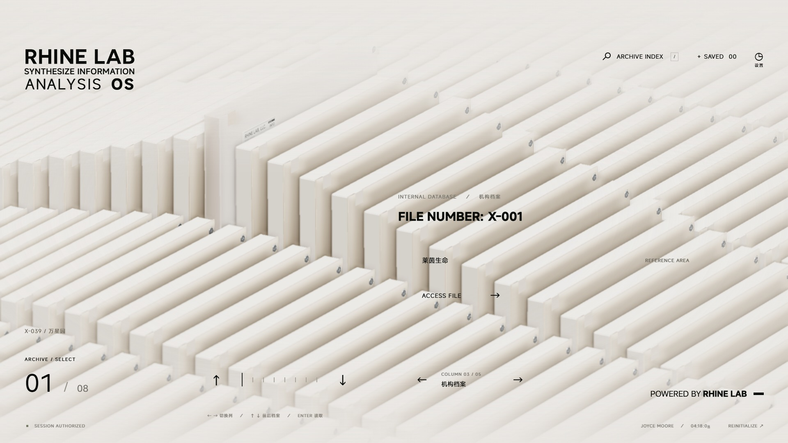
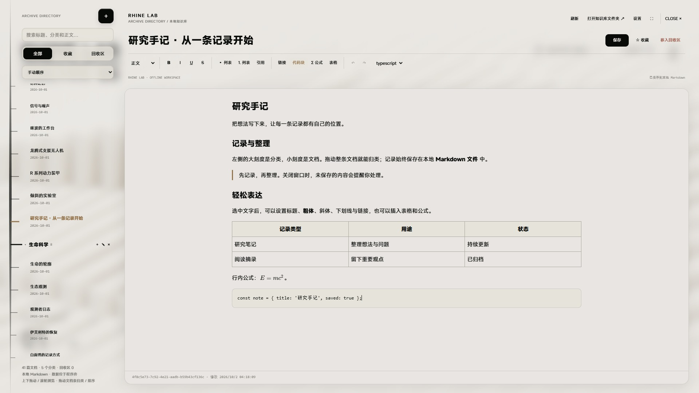
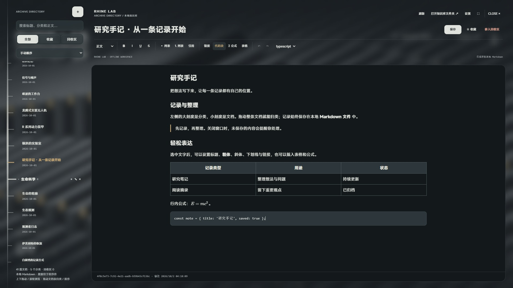
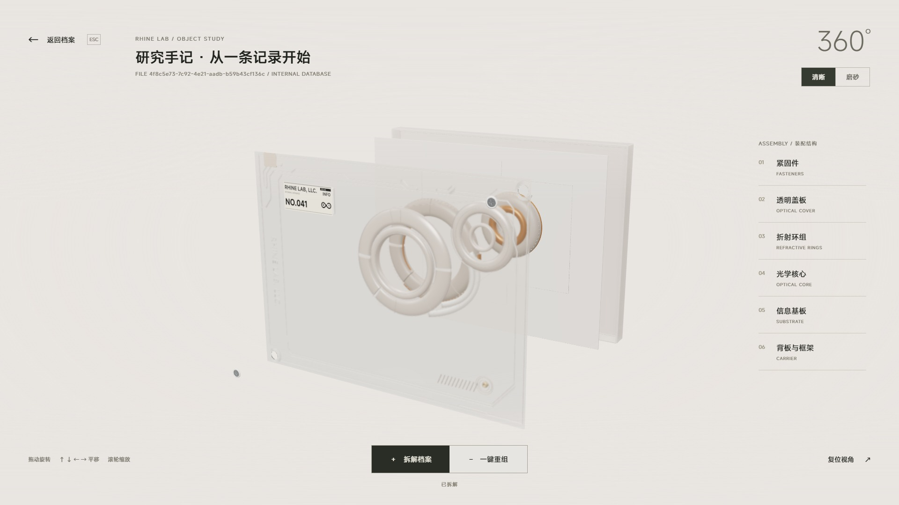
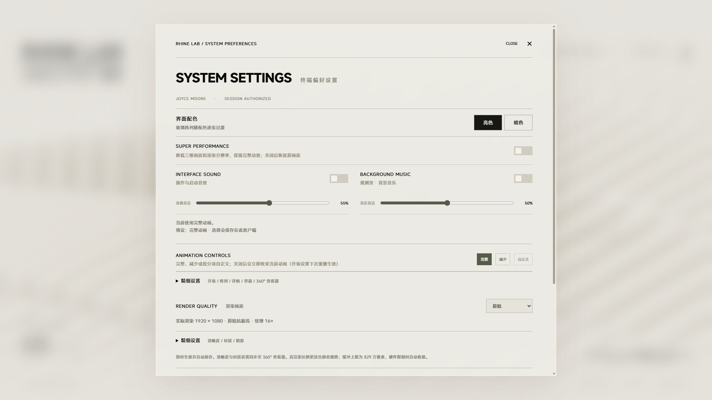

# RHINE LAB · 本地知识库

**把莱茵生命的三维终端，变成可以阅读、编辑和整理的本地知识库。**

**[下载 Windows 客户端 →](https://github.com/realhc/RhineLabUI-KM/releases/latest)** · [使用教程](#快速开始) · [操作说明](#操作说明) · [开发指引](AGENT.md)



Rhine Lab 是一个 Windows 便携客户端。实时渲染的档案阵列、玻璃解密与模型查看器围绕本地 Markdown 文档工作；知识库用全屏磨砂玻璃打开，左侧刻度目录、右上工具区与右下正文彼此独立。

文档保存在程序旁的文件夹中。无需账户、API Key、开发服务器或另外安装 Node.js，解压即可离线使用。

## 快速开始

1. 从 [Releases](https://github.com/realhc/RhineLabUI-KM/releases/latest) 下载 **RhineLab-win32-x64-1.2.0.zip**，完整解压到有写入权限的文件夹。
2. 运行其中的 **RhineLab.exe**。保留同目录的 `resources` 等运行文件，不能只复制 EXE。
3. 等待资源就绪，点击进入；可以点击 `ENTER SYSTEM` 跳过开场。
4. 点击 `ARCHIVE INDEX` 打开知识库，或从档案详情进入对应文档。

首次启动会建立 `RhineLabData`，导入 40 份示例档案。删除全部文档后也不会重新导入。当前提供 Windows x64 便携版，尚未签名；发布附件同时提供 SHA-256 校验清单。

## 界面与功能

### 刻度目录与玻璃工作区

目录像刻在玻璃上：主轴贯穿窗口，分类为大刻度，文档为小刻度。点击加号命名并创建分类或文档；分类可折叠，整条文档都能拖入分类或调整顺序。删除分类会保留文档，删除文档也不会删除分类。



目录支持滚轮和空白区域上下拖动，松手后按速度减速。玻璃层与三块区域错峰显现，文档切换轻微淡入，选中刻度缓慢呼吸；编辑和拖动时收束持续动效。系统和应用的减少动态效果设置均生效。

### 排版阅读与直接编辑

阅读与编辑使用同一份排版正文。按 **E** 或点击“编辑”进入编辑，**Ctrl+S** 或“保存”写入磁盘并继续编辑；切换其他文档后恢复阅读状态。

- 一级到四级标题、正文、粗体、斜体、下划线与删除线。
- 链接、引用、列表、代码块，以及表格的行列操作。
- 离线 LaTeX 行内公式与独立公式。
- 撤销/重做、全文检索、收藏、手动排序与回收区。

源 Markdown 保存在本地文件中，正文不显示源码分栏。外部修改与未保存草稿冲突时，可以取消、另存副本或重载磁盘版本。

### 明暗配色

暖灰底、细线与杏金强调延续到整个客户端。暗色使用烟灰玻璃和琥珀信号，字体、布局与编辑工具保持一致。



### 三维阵列、解密与模型查看器

阵列可循环浏览，档案竖直抽取后由镜头靠近并转正，玻璃与正文同步解密。独立查看器支持旋转、缩放、平移、清晰/磨砂切换、六组拆解与重组。



分类和文档的顺序映射到阵列的列与模型，完整知识库没有 40 篇上限。即使删空知识库，三维阵列仍然存在。启动及跳过开场的图形异常具有恢复入口；图形恢复不重载正在编辑的草稿。

### 声音、画质与动效

设置提供音效/音乐音量、亮暗配色、画质、全屏及完整/减少/自定义动画。超级性能模式与减少动画分别控制；关闭性能模式会恢复已保存的画质。



知识库进退场由 `SURFACE TRANSITIONS` 控制，文档切换由 `DOCUMENT REVEAL` 控制，刻度呼吸由 `IDLE MOTION` 控制，目录惯性由 `DRAG MOMENTUM` 控制。

## 操作说明

| 操作 | 效果 |
| --- | --- |
| 阵列中 `← / →`、`↑ / ↓` | 切换列和档案，支持循环 |
| 拖动阵列 / 滚轮 | 浏览档案，按实际速度滑行 |
| `Enter` / `ACCESS FILE` | 打开当前档案 |
| `ARCHIVE INDEX` | 打开知识库 |
| 知识库左侧 `＋` | 命名并创建分类或文档 |
| 拖动整条文档 | 归类或调整手动顺序 |
| `E` | 当前文档进入编辑 |
| `Ctrl+S` | 保存，继续编辑 |
| `Ctrl+N` / `Ctrl+F` | 新建文档 / 搜索 |
| `F11` / `Esc` | 切换全屏 / 退出全屏或关闭当前界面 |

删除文档先移入回收区，可以恢复；永久删除需要再次确认。切换文档、关闭知识库或退出程序时，未保存内容会提示保存、放弃或取消。

## 本地文件、备份与升级

```text
RhineLab/
  RhineLab.exe
  resources/
  RhineLabData/
    documents/<文档ID>.md
    .trash/
    backups/
```

每篇文档是 UTF-8 Markdown，文件头记录稳定 ID、标题、分类、顺序和时间。修改标题不改变文件名。其他 Markdown 编辑器可以读取这些文件；客户端会检测外部变化，也提供手动刷新。

迁移时先关闭程序，再复制整个程序文件夹。升级时先备份 `RhineLabData`，用新发行文件替换程序，**保留原来的 `RhineLabData`**。不要用空知识库覆盖它。设置与收藏可以独立导入/导出，但其 JSON 不包含文档正文。

演示文档位于 [content/desktop-demos](content/desktop-demos)，分别展示标题与文字格式、表格、代码、公式和快捷键。[详细数据说明](docs/DESKTOP.md)

## 项目路径与技术栈

以下路径均相对于仓库根目录。

| 路径 | 用途 |
| --- | --- |
| `desktop/` | Electron 主进程、受限桥接与文件仓库 |
| `src/` | 三维终端、知识库与富文本编辑器 |
| `public/` | 客户端模型、字体、配乐及许可 |
| `content/` | 初始档案与编辑器演示 |
| `art/` | 模型生成脚本及 Blender 源工程 |
| `release/packages/` | 本地生成的便携程序和 ZIP |
| `RhineLabData/` | 开发模式的个人知识库，不进入 Git |
| `AGENT.md` | 面向 AI 的开发边界、验证和下一步路线 |

使用 **Electron + Electron Forge、TypeScript、Three.js、Vite、Tiptap/ProseMirror、Markdown-it 和 KaTeX**。动画由原生 DOM/SVG、Web Animations 与三维时间轴驱动；文档使用文件仓库和原子写入，不依赖云端数据库。

开发需要 Node.js 22.12 或更新版本：

```powershell
git clone https://github.com/realhc/RhineLabUI-KM.git
cd RhineLabUI-KM
npm.cmd ci
npm.cmd run dev:desktop
```

生成便携客户端：

```powershell
npm.cmd run package:desktop
npm.cmd run check:desktop:package
```

更完整的源码说明、验证命令与维护规则见 [AGENT.md](AGENT.md)。截图来自实际客户端的隔离示例知识库，采集说明见 [docs/media/README.md](docs/media/README.md)。

## 原作者与许可

本项目基于 **[LBEILC / RhineLabUI](https://github.com/LBEILC/RhineLabUI)** 衍生开发，感谢原作者的终端视觉、三维模型、开场、声音及相关实现。本仓库由 **[realhc / Hong Chang](https://github.com/realhc)** 独立维护，新增本地知识库、排版编辑与桌面文件管理。

保留原作者 **Copyright (c) 2026 LBEILC** 与 [MIT License](LICENSE)。原作者有权授权的代码、模型、Blender 工程、原创配乐和素材依照该许可分发；修改并未取消第三方版权。MiSans、依赖库及 Electron/Chromium 保留各自许可，发行包附带第三方声明。

本项目是《明日方舟》莱茵生命终端视觉的非官方衍生项目，与官方制作方无隶属关系。原作名称、标志、设定、影像及音频采样的权利归各自权利人所有，不在本项目 MIT 授权范围内。独立许可的 Novecento 字体不进入便携包。[资源与分发说明](docs/DESKTOP-LICENSES.md)
