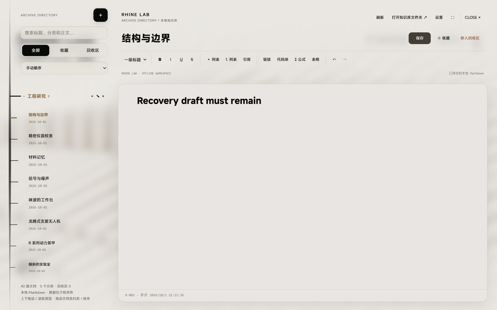
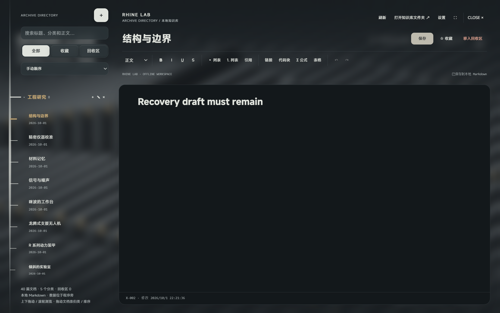

# 客户端启动、目录与性能修复

日期：2026-10-01。版本：1.1.2。真实发行程序的隔离副本用于验收，没有把个人知识库作为测试夹具。

## 启动与阵列恢复

本机复制原有设置和知识库后可正常显示阵列，因此没有认定用户白屏的唯一触发原因。本轮修复两类可导致持久白屏的确定性缺口：渲染帧异常会终止原 RAF；WebGL 丢失没有客户端恢复流程。

现在下一帧先排队，单次异常不阻止后续渲染。WebGL 丢失显示状态；原连接恢复时继续原场景，超过两秒未恢复则重建图形。重建保留实际循环位置、选中档案、画质、主题和编辑草稿，不重载文档页面。初次 GLTF 请求未结束时不并行替换场景，防止旧请求在释放后重新分配资源。无法恢复时提供重新载入入口；启动错误的重试按钮使用事件监听，避免被桌面 CSP 拦截。

[恢复结果](recovery-result.json) 覆盖真实点击进入/跳过开场、静音自动进入、多次重载、初次模型请求延迟三秒期间 GPU 丢失、即时恢复、持续丢失重建与草稿保留、单帧异常、窗口尺寸及最小化恢复。错误计数为空。

## 目录与功能区

主轴和大小刻度共享 CSS 轴心，文档拖拽提示移至右端，避免遮挡连接处。右上保持透明无底，分为全局操作、标题及文档操作、段落/字形/列表/插入/历史工具、保存状态。浅色三档尺寸及暗色功能区检查覆盖重叠、溢出、透明背景与阴影；原富文本、表格、LaTeX、快捷键、回收与重启功能继续验收。





## 知识库动效

参考 [onetake](https://github.com/feitangyuan/onetake) 的连续衔接与节奏停顿原则，以原生 CSS 和 Web Animations 实现，没有复制其素材或代码，也未引入新动效依赖。玻璃层只渐变透明度，保留原模糊强度；目录只淡入，主轴和刻度不位移。功能区与正文以约 360–440ms 的轻微纵向位移错峰出现，退出约 200ms；退场结束前保持原对话框的背景输入隔离。

文档更换时正文与标题淡入 220ms，连续输入、同文档选择和保存不重播。选中刻度以 3.8 秒周期轻微呼吸，编辑、目录拖拽或惯性滑行时暂停。离散滚轮与空白拖动释放按实际滚动位置衰减，小像素触摸板流继续由系统处理；刷新、归类、键盘、新按下和关闭均停止旧动量。系统减少动态效果与应用各分项开关共同控制，无布局、颜色或编辑状态变化。

实际客户端检查见 [动效结果](motion-result.json)，覆盖有限进退场、轴与刻度连接、文档输入与草稿保留、整条拖拽、动量中断、关闭后停止以及两种减少动态效果设置。

## 无画质损失的性能改进

- 编辑器约 794 kB 脚本和 66 kB 样式按需加载。启动主脚本从约 1,848 kB 减少到 1,058 kB；这表示首屏解析负担减少，不宣称帧率按同等比例增加。
- 普通阵列中扫描标记不可见时，不再投影卡片或重写 SVG。实际运行一秒观察到该 SVG 的零次 DOM 变更；显示扫描时仍使用原渲染器。
- 目录先批量读取行位置，再统一写样式；相同透视值不重复写入。
- 三个同时进行的文件列表请求共用一次扫描。完成后立即失效，写事务和文件监控事件切断旧扫描共享。检查包括相同大小/修改时间的外部改写、保存与监控并发以及读取失败重试；不使用 mtime 缓存。

模型精度、灯光、阴影、AO、景深、玻璃、纹理和分辨率保持原参数。本次记录来自单机客户端自动检查。

## 发行包清理与复现

构建只分发 Electron 主进程、受限桥接、文件仓库、初始示例和运行资源；完整字体、模型原始字节、原创配乐与许可材料保留。

在仓库根目录运行：

```powershell
npm.cmd run package:desktop
npm.cmd run check:desktop:package
npm.cmd run check:desktop
npm.cmd run check:desktop:recovery
npm.cmd run check:desktop:motion
node scripts/check-desktop-rich-editor.mjs
```

所有运行测试复制客户端并排除真实 RhineLabData，使用隔离配置。原有个人数据在交付前后逐文件核对。交付记录见 [delivery.json](delivery.json)，后续独立客户端发行检查见 [standalone](../standalone/README.md)。
