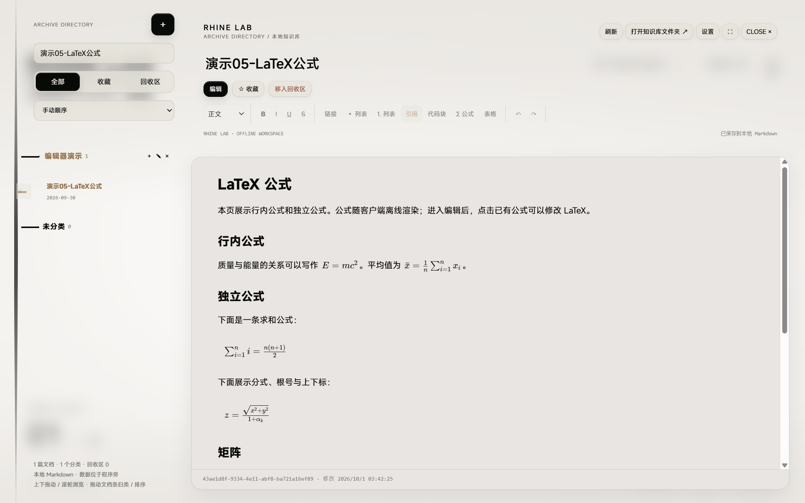

# 编辑器演示文档验收

2026-10-01：新增五篇可选 Markdown 演示，提供当前知识库操作与排版演示。

- 隔离知识库首次导入新增 5 篇；重复导入新增 0 篇。
- 原有文档的修订保持不变；回收区同名演示不会恢复或重复导入。
- 实际便携客户端的隔离副本逐篇验证标题、表格、代码块、五个 LaTeX 公式和只读状态；无页面脚本错误。
- 已导入当前交付客户端的本地知识库，归入“编辑器演示”分类；导入前的文档修订均保留。
- 个人知识库不提交，仅提交可复用演示源文件与导入脚本。

数据检查见 [result.json](result.json)，客户端渲染检查见 [render.json](render.json)。

