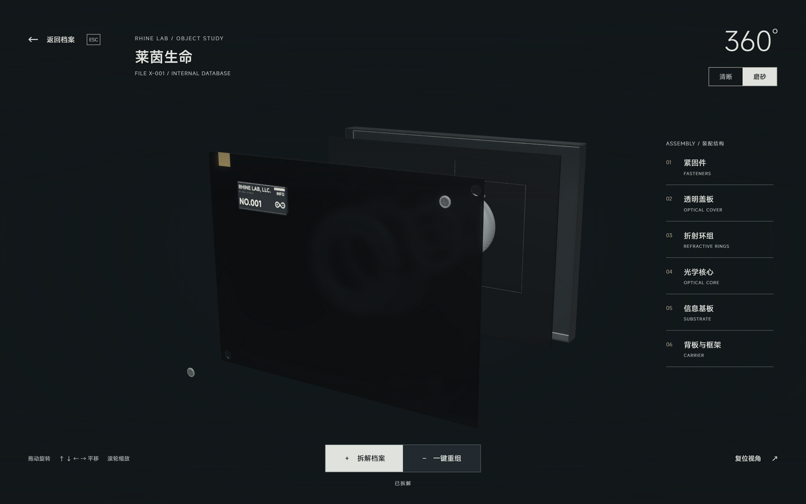

# P1 验收与后续维护

日期：2026-10-01。本轮完成 README 的三个 P1，并修复保存与外部文件监听之间的时序问题。网页源码保持原样。检查汇总见 [checks-result.json](checks-result.json)。

## 动态分类与阵列

`check-desktop-categories.mjs` 与 `check-desktop-exhibit.mjs` 验证原 40 篇档案映射、独立分类增删改名、文档归属、回收恢复、超过五个分类、单列 35 篇文档、重启和空阵列。实际客户端的分类 UI 检查验证整条拖动、折叠、删除后保持文档或分类、选中文档映射至阵列，以及删空后仍渲染三维模型。

检查结果见 [category-result.json](category-result.json)。工作流检查另验证手动拖动排序后的稳定 ID、归属与重启顺序。

## 编辑工作流

实际便携客户端在隔离目录中完成以下操作：

- 磁盘文件外部修改时保留草稿，取消保存不覆盖磁盘；另存副本同时保留两份内容。
- 放弃草稿并重新载入外部版本；外部删除后仍能将草稿另存。
- 有草稿时拖动排序可取消，也可先保存后排序；重启后顺序与文档 ID 保持。
- 正文输入、方向键、Enter、斜杠与 E 不操控底层场景；Ctrl+F 聚焦知识库搜索。
- 应用关闭事件触发未保存保护：继续编辑保持窗口与草稿，保存后可退出；放弃退出不写入草稿。重启检查磁盘正文。

原实现遇到“文件已改变但监听通知尚未到达”时，第一次保存只报错。现在保存失败后重新读取磁盘索引，确认修订变化或文档消失后立即提供冲突处理选项。不能只依赖跨 contextBridge 传递的 Error 自定义属性。

结果见 [workflow-result.json](workflow-result.json)。关闭检查触发实际 BrowserWindow 的 close 事件；测试记录原生对话框的文案、选项和默认取消行为，并注入选择返回值，因此不宣称人工点击了 Windows 原生对话框。完整富文本回归见 [rich-editor-result.json](rich-editor-result.json)。

## 视觉矩阵

亮暗主题分别在 100%、150%、200% DPI 检查九种画面，共 54 组：开场时间参数 4、14、24、32 秒（对应参考原片 9、19、29、37 秒），档案首页、详情、查看器清晰／磨砂／拆解。

网页基准直接从本仓库源码构建的本地 `dist/` 载入，没有更新旧基准文件来消除差异。网页与便携客户端运行在同一 Electron Chromium 中；网页窗口使用独立会话，不放开客户端的离线请求限制。测试使用既有 review 参数与消息冻结开场帧，Playwright Clock 统一动画时间；模型文件载入时恢复时钟推进，载入完成后再同步暂停；截图前等待查看器淡入结束，并关闭测试窗口的后台节流。

DPI 通过 Electron 的 `--force-device-scale-factor` 设置并读取 devicePixelRatio 校验。Windows 内容区显式设置相同尺寸，关键 DOM 边界逐项比较（容差 0.6 CSS 像素）。测试使用 ANGLE D3D11，关闭隔离测试进程的着色器磁盘缓存；运行资源、原始画质、材质、灯光和动画设置保持一致。

截图以实际设备像素比较。Windows 分数 DPI 取整最多允许一像素的外侧边缘差，比较共同矩形并记录两份原始尺寸；关键 DOM 边界仍按上述容差检查。阈值在脚本中固定：每通道平均差不超过 2/255；任一通道差超过 16/255 的像素不超过 0.2%。仅排除时间页脚、详情 Markdown 正文和操作按钮、查看器档案名区域；这些区域分别属于动态时间或已确认的桌面功能差异，截图保留完整画面。保存的 PNG 缩至 CSS 宽度供阅读，JSON 保留比较时的原始图像尺寸与统计。

54 组全部通过，最大单通道平均差为 0.479/255，超过 16/255 的像素最多占 0.000590%，无页面脚本错误。结果及每组截图见 [visual/result.json](visual/result.json)。



这是同一台 Windows 机器的自动化渲染回归，不代替不同显卡、多显示器切换或睡眠恢复验收。当前网页构建与客户端均使用仓库已有字体回退；在线站点的独立授权 Novecento 字体不纳入桌面再分发。

## 复现

在仓库根目录安装依赖，完成网页和桌面打包后运行：

```powershell
npm.cmd run build
npm.cmd run package:desktop
npm.cmd run check:desktop:p1
```

单独检查编辑工作流或视觉矩阵：

```powershell
npm.cmd run check:desktop:workflow
npm.cmd run check:desktop:visual
```

测试复制运行文件至 `release/` 下的独立目录，排除真实 `RhineLabData`，使用新用户配置和原始示例内容。不要以真实知识库作为测试夹具。视觉检查自行使用空闲本地端口提供网页构建，不依赖正在运行的 5173 服务。

## 交付

TypeScript、仓库文件操作、分类与阵列数据、分类 UI、富文本 UI 和本轮工作流均已验证。源码修复构建成功；本机打包工具子进程曾发生原生崩溃，因此使用原有 Electron 运行文件重新生成 app.asar 和便携 ZIP，并在这个发行目录的隔离副本上完成 UI 验收。

更新发行包时逐文件保留真实知识库，52 项原有数据文件哈希前后相同。运行中的旧客户端需退出后重新打开才能加载修复。发行包哈希与数据保护记录见 [delivery.json](delivery.json)。本轮只提交源码、测试、README 与验收证据；用户知识库及发行二进制不进入 Git。
